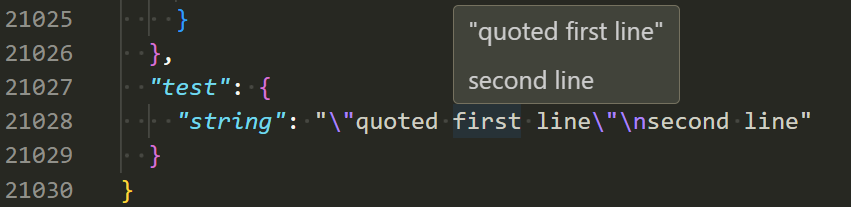

# json-hover

VSCode extension to show string values on hover for JSON files.

This is useful to convert escaped strings to their unescaped values (e.g. `\n` and `\"`).

## [CHANGELOG](https://github.com/DiscreteTom/json-hover/blob/main/CHANGELOG.md)
